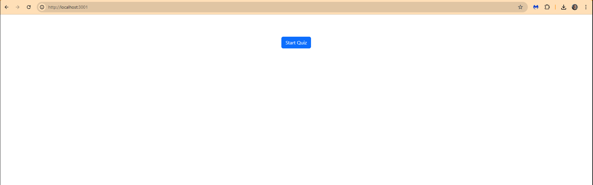

# Tech Quiz Test Suite

This is a MERN application that provides a quiz based on random programming questions.

## Features

- Quiz generation from MongoDB questions
- Component and E2E tests using Cypress
- Built with React, Vite, Node, Express, and MongoDB

## Tests

- ✅ Cypress Component Testing
- ✅ Cypress End-to-End Testing

## Installation

```bash
npm install
cd client && npm install
cd ../server && npm install
```

## Usage
Start the backend server:

```bash
cd server
npm run seed     
npm start
```
Start the frontend dev server:

```bash
cd client
npm run dev
```

The following animation demonstrates the application functionality:



## 📹 Demo & Repository

## Walkthrough Video

🎥 [Click here to watch the walkthrough video](https://your-video-link-here.com)

This video demonstrates:

Cypress Component and E2E tests running and passing ✅

How to run the application and tests from the command line 🖥️

### 💻 GitHub Repository

Access the source code here:

👉 [Book Search Engine GitHub Repo](https://github.com/MichGuzman/Tech-Quiz-Test-Suite)


👩🏻‍💻 Developed by

Michelle Guzmán
GitHub: @MichGuzman

📄 License
This project is licensed under the MIT License.

---
© 2025 edX Boot Camps LLC. Confidential and Proprietary. All Rights Reserved.
